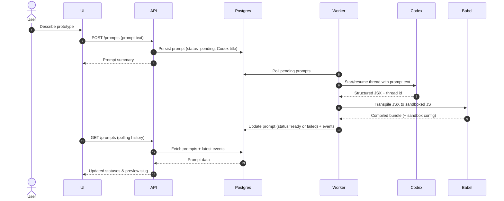

# Rapid Prototyper

Rapid Prototyper is a companion tool for design interviews that turns natural-language briefs into live React concepts. A Codex-powered worker converts each prompt into JSX, Babel compiles the output, and the dashboard lets reviewers inspect history, logs, and previews in seconds.

## Quick Start

### Prerequisites
- Node.js 20+ and npm
- Docker (for the bundled Postgres 15 instance) or a local Postgres database that matches the URLs in `.env.sample`
- An OpenAI Codex API key (`OPENAI_API_KEY`)

### Local setup
1. **Clone and install**
   ```bash
   git clone https://github.com/<your-org>/rapid-prototyper.git
   cd rapid-prototyper
   npm install
   ```
2. **Configure environment**
   ```bash
   cp .env.sample .env
   # edit OPENAI_API_KEY, ADMIN_EMAIL/PASSWORD, etc.
   ```
3. **Start Postgres**
   ```bash
   docker compose up db -d
   ```
4. **Migrate + seed**
   ```bash
   npm run db:init
   ```
5. **Launch the stack**
   ```bash
   npm run dev:stack
   ```
   | Service | URL | Notes |
   |---------|-----|-------|
   | API | http://localhost:4000 | Express + session auth |
   | UI | http://localhost:5173 | Vite dev server |
   | Worker | logs in `.logs/worker.log` | Polls Codex threads |

Use the seeded admin credentials from `.env` to sign in, submit a prompt, and watch the “Understanding Prototype” spinner until Codex returns a 4–5 word title and preview.

## Backend Flow


[Codex Integration Details](./docs/codex.md)


## Tech Stack
- **Frontend:** React 18, Vite, Chakra UI, Emotion, Babel-in-browser preview runtime, TypeScript
- **Backend:** Node.js, Express, Knex, PostgreSQL, session + CSRF protection, structured logging
- **AI workflow:** @openai/codex-sdk threads, JSON-schema constrained output, Babel transpilation for safe sandbox execution
- **Tooling:** npm workspaces, ts-node-dev, custom `dev:stack` orchestrator, Docker Compose for Postgres
