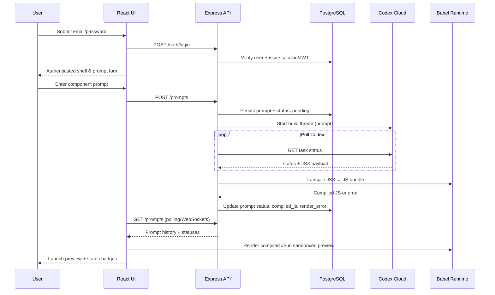

# Rapid Prototyping with AI — Technical Plan

This document captures requirements and an implementation plan for a three-tier web application that lets users describe React-based components as an LLM prompt, and uses OpenAI Codex to generate the component code to preview. The plan is structured to support TDD, vertical slices, and iterative delivery, with AI playing roles both in building and operating the system.

## Goals and Scope
- Deliver a secure, login-gated web app that persists credentials and prompt history.
- Allow users to submit natural-language descriptions for React UI components via an LLM prompt box.
- Generate short, AI-summarized titles for each prompt
- Track status of the generating components from "Building" to "Complete".
- Use OpenAI Codex Cloud to generate code changes, and Babel's standalone build to transpile the JSX to JS so that it can be rendered in the browser
- Maintain a clear separation of concerns across database (PostgreSQL), API (Express/Node), and UI (React + component framework such as Material UI or Chakra UI).
- Follow dotenv-based configuration with `.env.sample` guidance and secrets kept out of version control.
- use docker to run the database layer and docker-compose at the root level

## Architecture Overview
- **UI**: React single-page app served by the Express backend; uses a component library for form controls, cards, status badges, and modals.
- **API**: Express server with REST endpoints for authentication, prompt submission, status polling, and launch URL retrieval. Uses JWT or session cookies for auth, with password hashing (e.g., bcrypt) and CSRF protections.
- **Database**: PostgreSQL storing users, prompts, build tasks, and rendered preview metadata. Migrations managed via a tool like Knex or Prisma.
- **LLM Integration**: OpenAI Codex SDK invoked from server-side workers to generate code change sets. Calls occur in Codex Cloud (remote execution), not on the local host. The server persists task IDs for polling status.
- **Rendering Runtime**: Babel (standalone) transpiles Codex-generated JSX into runnable JavaScript on demand, and the results are cached in the database for previewing without any CI/CD pipeline.
- **Observability**: Verbose structured logging (request IDs, job IDs, prompt IDs) lives across API, workers, and UI devtools so every Codex task and preview render can be traced end-to-end during debugging.

### Babel Transpilation Strategy
- Use Babel's browser-friendly standalone build so the React UI can compile Codex-generated JSX on the fly without server-side bundling.
- Provide a reusable `DynamicComponent` wrapper that accepts JSX code, transpiles it with the `react` preset, and renders the resulting `App` export (or a null component) while surfacing syntax runtime errors to the user.
- Inject `React`, `useState`, and `useEffect` into the generated function scope so Codex-authored components can rely on hooks.
- Capture transpilation errors and persist them alongside prompt metadata so the UI can show graceful fallbacks and debugging information.

```tsx
import * as Babel from '@babel/standalone';
import React, { useState, useEffect } from 'react';

function DynamicComponent({ code }) {
  const [Component, setComponent] = useState(null);
  const [error, setError] = useState(null);

  useEffect(() => {
    try {
      const transformed = Babel.transform(code, {
        presets: ['react'],
        filename: 'dynamic.jsx',
      }).code;

      const componentFactory = new Function(
        'React',
        'useState',
        'useEffect',
        `${transformed}; return typeof App !== 'undefined' ? App : (() => null);`
      );

      const GeneratedComponent = componentFactory(React, useState, useEffect);
      setComponent(() => GeneratedComponent);
      setError(null);
    } catch (err) {
      setError(err.message);
      setComponent(null);
    }
  }, [code]);

  if (error) return <div className="error">{error}</div>;
  if (!Component) return <div>Loading...</div>;
  return <Component />;
}
```



## Codex SDK Usage

The main repository for this SDK is here: https://github.com/openai/codex/tree/main/sdk/typescript

Install 
```
npm install @openai/codex-sdk
```

Start a thread
```
import { Codex } from "@openai/codex-sdk";

const codex = new Codex();
const thread = codex.startThread();
const result = await thread.run(
  "Make a plan to diagnose and fix the CI failures"
);

console.log(result);
```

Call run() again to continue on the same thread, or resume a past thread by providing a threadID.
```
// running the same thread
const result = await thread.run("Implement the plan");

console.log(result);

// resuming past thread

const thread2 = codex.resumeThread(threadId);
const result2 = await thread.run("Pick up where you left off");

console.log(result2);
```

## Data Model (initial)
- **users**: id (uuid), email (unique), password_hash, created_at, updated_at, last_login_at.
- **prompts**: id (uuid), user_id (fk), prompt_text, title, status (pending|building|ready|failed), codex_task_id, compiled_js, preview_slug, render_error, created_at, updated_at.
- **events/logs** (optional): prompt_id, message, level, created_at — for auditability of AI actions.

## Key Flows
1. **Authentication**
   - User enters email/password; API verifies credentials against hashed passwords in PostgreSQL and issues a signed JWT stored in HTTP-only secure cookies.
   - Sign-up could be admin-provisioned initially; add registration later as a vertical slice.

2. **Prompt Submission**
   - UI posts prompt text to API; API concurrently requests a short title from Codex or a lightweight LLM call and stores prompt with status `Building`.
   - API kicks off a Codex Cloud build task; stores the resulting `codex_task_id` (and eventually the returned JSX) for Babel to transpile.
   - a new card in the prompt history appears with the prompt summary and the status

3. **Build Orchestration**
   - A background worker or polling loop polls the Codex thread for task completion.
   - when the code sample is completed, Babel should be used to convert it into a React component that can be viewed by user by clicking on the card, a button called "View"   

4. **History + Launch**
   - UI polls or subscribes to status updates (e.g., SSE/WebSockets or periodic GET) to update cards.
   - "Launch" buttons remain disabled until `status=Done`. when the button is clicked, the app should navigate to a view where the app is shown in a preview, with a back button to return to the main screen


## Environment & Configuration
- Use `dotenv` to load configuration from `.env` or `local.env` files.
- Ensure `.gitignore` excludes actual secrets (`.env`, `local.env`, `*.pem`).


## Presentation Outline (<5 minutes)
1. **Problem & Vision (45s)**: Need rapid UI prototyping; introduce the Codex-powered workflow and three-tier design.
2. **Architecture Tour (60s)**: Quick diagram of UI → API → DB, Codex Cloud
3. **Live Flow (90s)**: Demo login, submit prompt, watch history card move from Pending to Ready; launch preview URL.
4. **Under the Hood (60s)**: Codex Cloud task creation, Babel transpilation, status polling.
5. **AI in the App & Development (45s)**: AI-assisted development with TDD + vertical slices; AI-generated titles and code builds inside the app.
6. **Closing (30s)**: Security (auth, secrets), dotenv setup, and next steps (feature flags, observability).

## Next Steps
- Finalize repository structure and scaffolding scripts.
- Implement Iteration 0 with CI and basic auth tests to validate the end-to-end stack before integrating Codex.
- Finalize the Babel transpilation service design so future iterations consistently render Codex output without external pipelines.

## Iterative Delivery Roadmap
Each iteration is a vertical slice that results in a reviewable, running system. Deliver them sequentially so that later work can reuse infrastructure, fixtures, and feedback from earlier steps. Every iteration must ship with verbose structured logging for the surfaces it touches so that new flows remain traceable end-to-end.

### Iteration 0 — Scaffolding & Baseline Login
- Create the monorepo structure (apps/ui, apps/api, infra) with shared TypeScript config and linting.
- Add Docker Compose that boots PostgreSQL with seed data and `npm start` targets for API/UI. Provide `.env.sample`.
- Ship a single `scripts/db:init` (npm or bash) wrapper that runs migrations and seeds in one command for local/dev bootstrap.
- Implement minimum Express route that serves the React bundle and a Chakra/MUI login screen.
- Wire the login form to a stub `/auth/login` that validates against the seeded password (hash with bcrypt even if single user).
- Smoke tests: `docker compose up` results in DB ready, migrations applied, admin user inserted, and the login screen authenticates the seeded password to store a session cookie/JWT.

### Iteration 1 — Authentication Hardening & Session Management
- Replace stub auth with real `/auth/login` + `/auth/logout`, password hashing, CSRF middleware, and JWT/session storage.
- Add user repository + integration tests with the seeded DB plus a CLI to create additional accounts.
- Gate the React router so that unauthenticated users are redirected to `/login`; add success/failure alerts and loading states.
- Introduce base CI workflow that runs lint + auth tests to keep the scaffolding stable.

### Iteration 2 — Prompt Submission & History
- Build `/prompts` REST endpoints with Prisma/Knex migrations for the `prompts` table.
- UI: authenticated users can submit a prompt, see optimistic cards with generated short titles, and observe `Pending → Building` status transitions.
- Add a lightweight “title generation” service (can be deterministic or mocked) plus worker job metadata for Codex task IDs.
- Seed prompt fixtures and add integration tests verifying persistence + history retrieval per user.

### Iteration 3 — Codex Orchestration & Dynamic Bundling
- Integrate the Codex SDK service that can start/resume threads, persist task metadata, and store returned JSX safely.
- Build the background worker that polls Codex, feeds completed JSX through Babel, captures transpilation errors, and stores the compiled JS + metadata in PostgreSQL.
- Harden the preview storage format (e.g., sanitized HTML/JS blobs, sandbox configs) and expose worker health metrics/logs.
- Protect secrets via dotenv + `.env.sample` instructions and ensure failures are logged in the optional events table.

### Iteration 4 — Preview & Launch Experience
- Enhance the prompt cards with progress badges, Codex logs, and actionable “View” buttons once `status=ready`.
- Add Babel standalone compilation in the UI to render returned React components safely in a sandboxed iframe/modal.
- Provide a detail view with the preview, prompt summary, generated title, timestamps, and a “Back to history” CTA.
- Add polling/WebSocket updates so cards move from Pending → Ready automatically; disable Launch until previews exist.

### Iteration 5 — Operations, Observability & AI Assist
- Instrument API and worker logs/metrics (e.g., OpenTelemetry exporters) plus alerting hooks for failed builds.
- Add feature flags for Codex interactions so environments can toggle external calls and Babel rendering experiments.
- Document AI + human handoffs, including fallbacks when Codex fails or when Babel transpilation errors block previews.
- Polish UX (empty states, retry buttons) and finalize the presentation outline for stakeholder demos.
