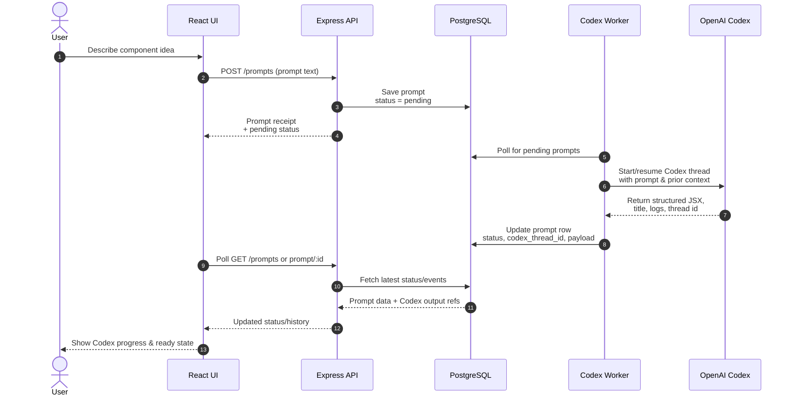

```mermaid
sequenceDiagram
    autonumber
    actor User
    participant UI as React UI
    participant API as Express API
    participant DB as PostgreSQL
    participant Worker as Codex Worker
    participant Codex as OpenAI Codex

    User->>UI: Describe component idea
    UI->>API: POST /prompts (prompt text)
    API->>DB: Save prompt<br/>status = pending
    API-->>UI: Prompt receipt<br/>+ pending status
    Worker->>DB: Poll for pending prompts
    Worker->>Codex: Start/resume Codex thread<br/>with prompt & prior context
    Codex-->>Worker: Return structured JSX,<br/>title, logs, thread id
    Worker->>DB: Update prompt row<br/>status, codex_thread_id, payload
    UI->>API: Poll GET /prompts or prompt/:id
    API->>DB: Fetch latest status/events
    DB-->>API: Prompt data + Codex output refs
    API-->>UI: Updated status/history
    UI-->>User: Show Codex progress & ready state

```